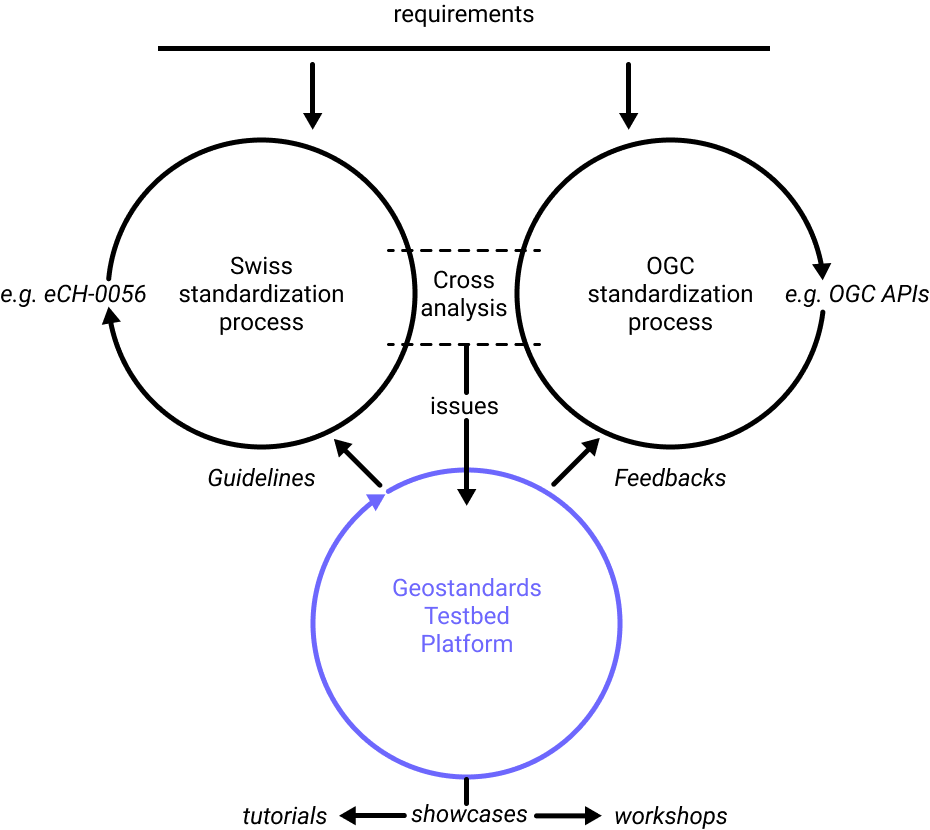
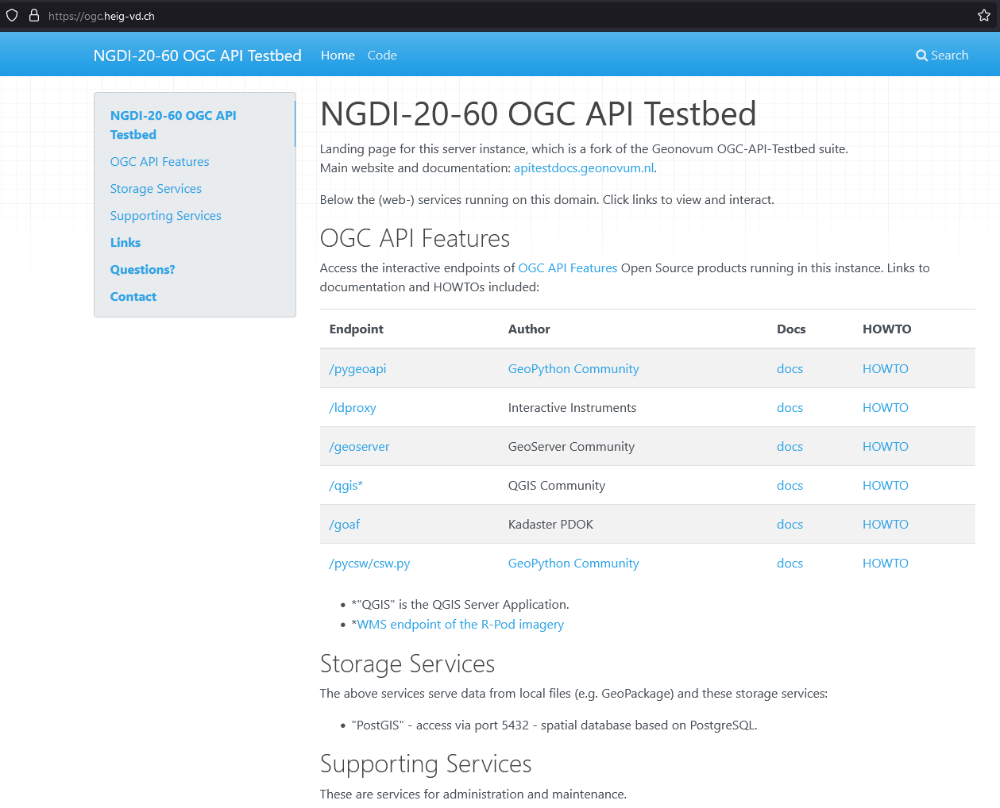

// Document settings
[.text-justify]

== Methodology

Given the above general purpose, the intent is to develop knowledge and practice of these OGC API standards so as, for instance, to update guidelines of the instructions stated by eCH- 0056. More generally, how can the advances coming out from the OGC standardization process be integrated into the Swiss standardization process and even vice versa. The idea in this project is to setup a Testbed Platform to connect these two processes as illustrated by figure 1 by considering issues related to how requirements defined by stakeholders are handled by standardization works both sides. By running at each iteration a showcase on specific use cases with a set of standards to challenge, the Testbed Platform brings results as update guidelines (e.g. for eCH working groups in the field of geoinformation) and feedbacks (e.g. OGC Change Requests). In addition, such a vision can provide an opportunity for dissemination and training material creation (e.g. tutorials, workshops).

Several activities are to be carried out to feed and run such a platform, among them: requirements analysis with stakeholders, identification of underlying standards to challenge, subscription/following in the relevant standards working groups, definition of experimental cases and evaluation criteria, deployment and maintenance of software to run showcases, documentation and dissemination.

For this project, to be seen as a first iteration, the expected outcomes include both quantitative and qualitative results that will be compiled into practical e-government guidelines for the implementation of standards from the OGC API family. The selected mainstream topic for the showcase and the underlying experimental cases is about climate change. While not yet connected in a complex pilot study, each case represents some of the required components from sensors to portrayal. The study is organized in three parts to challenge standards with software related to: (1) sensors data (2) data discovery, access and portrayal (3) earth observation data.

//Figure

.Proposed vision to connect Swiss and OGC standardization processes through a Testbed Platform

In term of software, the idea is to offer a unique project entry point for the discovery, experimentation and analysis of the new OGC APIs. To develop the knowledge and practice required, openness is not only related to the standards evaluated, but also required for the software aspects of the Testbed platform. That’s why we identified the Geonovum OGC API Testbed tooling stack cite:[apitestbed] as a good base. It includes already open sourceopen-source packages and provides a detailed documentation available on GitHub. We deployed a project instance at https://ogc.heig-vd.ch/[https://ogc.heig-vd.ch/] (figure 2) which still needs to get populated with the underlying data and configured to serve everything required to run the experimental cases, from server to client sides. This solution will also be used to create tutorials in the style of the documentation proposed by Meteo Canada cite:[eccc-msc].

//Figure 
//Find a way to add a cross-reference in the text
.Landing page of the Testbed platform

This solution is expected to bring good visibility toward all actors concerned by the Swiss standardization process. It is to raise interest from government stakeholders, companies and universities, technical people or not, as a community in synergy when considering the advances at the OGC.

To test the experimental cases, FOSS4G implementations are deployed, especially server-side software with:

//FROST
* https://www.iosb.fraunhofer.de/en/projects-and-products/frost-server.html[FROST] : focusing on sensor observation standards
//Geoserver
* https://geoserver.org[Geoserver] : quite active in the implementation of a wide set of OGC API standards
* https://github.com/interactive-instruments/ldproxy[ldproxy] : focusing on OGC API Features as an adapter sitting in front of existing WFS services
* https://pygeoapi.io[pygeoapi] : active in the implementation with the largest set of OGC API standards of the panel
* https://qgis.org[QGIS Server] : quite active community in Switzerland, implementing also an OGC API Features client

The choice of these solutions was made to cover all the standards to be challenged in this project as well as with the variety of programming languages of the most common OSGeo software, the ease of deployment and the quality of their documentation. Table 1 has been built by going over the OGC API landing page of each, in conformance with the Landing Page Requirements Class of the specification OGC API - Common - Part 1: Core (OGC, 2021a).

//Table

.Implementations according to conformance declarations (status as of May 2022)
[cols="1,1,1,1,1,1"]
|===
^.^|
^.^|FROST
^.^|Geoserver
^.^|ldproxy
^.^|pygeoapi
^.^|QGIS Server
//
^.^|SensorThingsAPI + 
    https://docs.ogc.org/is/18-088/18-088.html[(OGC:18-062r2)]
^.^|✅
^.^|
^.^|
^.^|
^.^|
//
^.^|Features + 
    https://docs.opengeospatial.org/is/17-069r3/17-069r3.html[(OGC:17-069r3)]
^.^|
^.^|✅
^.^|✅
^.^|✅
^.^|✅
//
^.^|Maps + 
    http://docs.ogc.org/DRAFTS/20-058.html[(OGC:20-058)]
^.^|
^.^|✅
^.^|
^.^|
^.^|
//
^.^|Styles + 
    http://docs.opengeospatial.org/DRAFTS/20-009.html[(OGC:20-009)]
^.^|
^.^|✅
^.^|
^.^|
^.^|
//
^.^|Tiles + 
    http://docs.ogc.org/DRAFTS/20-057.html[(OGC:20-057)]
^.^|
^.^|✅
^.^|
^.^|
^.^|
//
^.^|Coverages + 
    http://docs.ogc.org/DRAFTS/19-087.html[(OGC:19-087, draft)]
^.^|
^.^|✅
^.^|
^.^|✅
^.^|
//
^.^|DGGS (draft)
^.^|
^.^|✅
^.^|
^.^|
^.^|
//
^.^|EDR + 
    https://docs.ogc.org/is/19-086r4/19-086r4.html[(OGC:19-086r4)]
^.^|
^.^|
^.^|
^.^|✅
^.^|
//
^.^|Processes + 
    https://docs.ogc.org/is/18-062r2/18-062r2.html[(OGC:18-062r2)]
^.^|
^.^|
^.^|
^.^|✅
^.^|
//
^.^|Records + 
    http://docs.ogc.org/DRAFTS/20-004.html[(OGC:20-004)]
^.^|
^.^|
^.^|
^.^|✅
^.^|
|===

