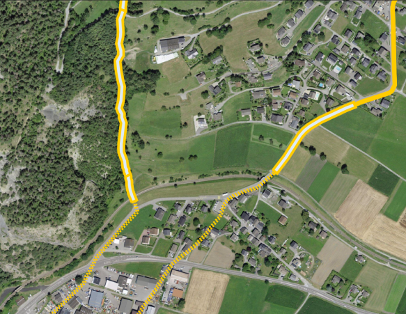

// Document settings
[.text-justify]

== Uses cases

=== Sensor Data Standards

In Switzerland there's no official standard defined to share with geospatial interoperability located environmental observations. In fact, the eCH-0056 at section 6.14 _Services de mesure et d’exploitation_ indicates the OGC SOS v2.0 :cite[ogc-sos] and the Sensor Planning Service (SPS) v2.0 :cite[ingo2011ogc] as reference standard but indicates that currently no directive or recommendation is in place.
The SOS standard was initially released in 2012. It follows the classical OGC WxS services. It defines interfaces toward sensors (data producers) and users (data consumers) based on the Simple Object Access Protocol (SOAP). Data are encoded in Extensible Language Markup (XML) and are based on the OGC Observations and Measurements (O\&M) :cite[cox2011observations] to represent data and ONT the OGC SensorML :cite[bott2007opengis],:cite[robin2014ogc] to represent sensor description. The standard exposes two main requests for data producers: (1) _RegisterSensor_ to add a procedure to the service by means of a SensorML description and (2) _InsertObservation_ to inject a new observation using the O\&M. To interact with the users SOS offers three main requests: (1) _GetCapabilities_ to conform with OGC commons and access metadata about the server, including how to generate requests and what parameters can be used; (2) _DescribeSensor_ to access the information in SensorML of a specific procedure that generates the data; and (3) _GetObservation_ to download data in O\&M format applying filters on sensors, location, time, observed properties and feature of interest.
Due to the extra effort of Web Interfaces to parse and handle XMLs some SOS software like istSOS :cite[cannata2019performance] and 52North-SOS implementations started to develop their own JSON based API. To cope with this problem, in 2015 the OGC developed the SensorThings API (STA) version 1.0 :cite[ogc-sensorthings], which is not actually part of the OGC API but share most of the approaches, which are based on the use of RESTful services and JSON format. We can consider this standard as the evolution of the SOS toward the implementation of ready-to-consume services for Web user interfaces. The main difference in the data model (see figure below) is the conceptualization of _Datastream_ which groups observations measuring the same observed property and produced by the same sensor and of _Things_ which is a physical element that is integrated in the communication network (similarly to a Wireless Sensor Network node). STA offers a Representational state transfer (RESTful) API that permits to create, read, update, delete (CRUD) elements using the HTTPS verbs (POST, GET, PATCH, DELETE). Entities are accessed by IDs and URLs. URLs can be extended to interrelated elements and defined query parameters can be set.

//Figure

.SensorThings API data model OGC SensorThings API v1.0
image::Images/SensorThingsUML_Core-v2.png[align="center"]

==== Environmental Observations and Consuming Applications in Switzerland

Major Swiss authoritative national offices that manage monitoring network for environmental data are: (1) MeteoSwiss, the national meteorological office that collects weather information from the _SwissMetNet_ that comprises about 160 automatic monitoring stations observing weather and climate variables and about 100 automatic precipitation stations :cite[suter2006swissmetnet]; (2) Federal Office for the Environment (FOEN) that use the hydrometric monitoring network composed by about 260 stations observing surface water levels and discharges :cite[schwanbeck2018reti]; and (3) Swiss Federal Institute for Forest, Snow and Landscape Research (SLF) that manage the _IMIS (Intercantonal Measuring and Information System)_ network comprising 186 stations measuring snow, wind  and other avalanche specific parameters.
At the best knowledge of the authors, none of these offices uses any sensor related OGC standards and their Web application for data access are based on specific own non-standard solutions. In most of the cases, the Web application consists in a map with base layers served by OGC WxS services and a static vector layer of the stations localization (GeoJSON or KML) with owner defined metadata. Once a location is selected, the application, using the metadata, compose the URL that points to the observations stored in a static file (JSON, CSV or even PDF).
For example, the FOEN exposes on the Web the location of monitored water temperatures as a static GeoJson (https://data.geo.admin.ch/ch.bafu.hydroweb-messstationen_temperatur/ch.bafu.hydroweb-messstationen_temperatur_de.json) with an id attribute, used to later access another static file in CSV (https://www.hydrodaten.admin.ch/lhg/az/dwh/csv/ BAFU_2167_Wassertemperatur1.csv) format and containing a series of Time-Value Pairs (TVP). Other similar examples can be found at https://meteolakes.ch and at https://meteoswiss.ch.

==== Testbed actions

The hydro-meteorological monitoring network of the Canton Ticino is currently managed using the Sensor Observation Service (SOS) standard :cite[ogc-sos]. It has been selected as representative of a practical implementation of basic data required for the climate change impact assessment pipeline. The network, which has a 40 years long time-series, is currently composed of 60 stations and 140 sensors observing precipitation, air temperature and humidity, water temperature, river height. Collected information is operationally used by the local administration to design and actuate water resources protection and allocation to guarantee a sustainable management of the resource and the natural environment while protecting from the impacts of extreme events like floods and droughts. The Sensor Things API operational applicability is evaluated by testing this standard to fulfil all the major in place daily practical operations like for example data quality management, data sharing with third parties, data collection from vendor specific sensors and data analyses and visualization.
At this stage of the research, the FROST implementation of STA has been set up and the data migration scripts has been prepared and are processing the data migration that is not yet completed. Nevertheless, some preliminary considerations can be derived.

The first tested step is the migration of the SOS service to the STA service. To perform this operation a number of mapping and assumption has to be done and consequently a script has been implemented to automatically migrate data. The equivalent of registering a sensor in SOS is the creation of a _Datastream_ (POST request) that includes connection with (1) a sensor, (2) an observed property and (3) a things with possibly the location. To do so you therefore need to either have the IDs of the three related elements to be used as a reference, creating them in advance if they do not exists, or include directly the elements in the payload. It is worth to be noted that in FROST, any included elements in the request, if not indicated as a reference, is going to be created regardless the existence of a perfectly equal element. This potentially lead to duplicated elements: think of a set of 10 self registering sensors that measure precipitation, at each registration they will create a new _ObservedProperty_ resulting in 10 elements with the same name, definition and description, but with different ID. For this reason the script, register only once the different elements keeping track of the IDs and finally create the _Thing_. After that, the script can start collecting observations from SOS and injecting them on the STA using a POST request of _Observations_. While in istSOS we can register multiple observations at once providing a _swe:DataRecord_ in FROST this is not possible, and observations are going to be inserted one by one. This operation make the data migration using standards a slow process, so that the data migration rate is of 1,88 observations/second. For a 20 years long series of 10 minutes data that therefore has 1,051,200 observations this result in a migration time of 22,87 days. It worth to be noted that this rate is not affected by the data retrieval request to SOS since observations are retrieved in chunks of 7 days and only when in memory sequentially injected in a loop of POST requests.
Another aspect to consider is that in istSOS you can register observations of multiple observed properties making use of the _swe:DataArray_ and similarly in FROST using the _Multidatastream_ extension that represents a complex observation type. While in istSOS you can retrieve the observations of one of the _observedProperties_ in FROST you can retrieve them only as a complex observation.
Finally, in general in STA the three elements have a very minimal set of required information, and in this sense remove part of the complexity of SOS. Nevertheless to cope with compatibility it allows to extend metadata with generic fields to be used discretionally by the user to store "text-like" objects (e.g.: JSON, XML). For example USGS :cite[usgsSTA] in the \textit{Property} field of the _Things_ inserted specific information like _monitoringLocationType_ or _hydrologicUnit_ that are then used to access data. This makes the solution compliant with STA but this lead to loosing practical interoperability since each agency would use it with non defined metadata (what an _hydrologicUnit_ means? where is its definition?).
Future analyses will investigate the performance of Message Queuing Telemetry Transport (https://mqtt.org/) interface for data migration, the compatibility with data validation procedures and possible implications derived by its adoption.

=== From data discovery & access to portrayal

==== Background

In the context of data discovery, access and portrayal, the well-known OGC WxS standards WFS :cite[ogc-wfs], WMS :cite[], WMTS :cite[ogc-wmts] have been used for more than ten years and still widely in use. In association with these standards, styling aspects are defined by the standards SLD :cite[ogc-sld] \& SE :cite[ogc-se]. These are typically referenced by the eCH-0056 Geoservices Application Profile: WMS 1.3.0 (section 6.7), WMTS 1.0.0 (section 6.8), WFS 2.0 (section 6.9.2), WCS 2.0.1 (section 6.9.3), CSW 2.0.2 (section 6.10), SE 1.1.0 (section 6.11) and SLD 1.1.0 (section 6.12).

For this project part, we focus on standardisation work at the OGC related to discovery, data access to visualisation, as made available at https://ogcapi.ogc.org/ and according to their versioning mentioned by the table below. Indeed, the table describes the relationship between the considered OGC APIs and their current equivalents in the context of raster and vector related standards.

.From WxS family to OGC APIs
[cols="1,1,1"]
|===
^.^|OGC API
^.^|Version
^.^|WxS fashioned

^.^|OGC API Features
^.^|1.0
^.^|WFS

^.^|OGC API Maps
^.^|0.0.1
^.^|WMS

^.^|OGC API Styles
^.^|1.0.0
^.^|SLD

^.^|OGC SymCore
^.^|1.0
^.^|SE

^.^|OGC API Tiles
^.^|0.0.4
^.^|WMTS

^.^|OGC API Records
^.^|1.0.0
^.^|CSW
|===

To test and analyze these standards and specifications, two experimental cases are setup:

- with the use of Geoclimate :cite[Bocher2021], an open source geospatial toolbox that computes a set of urban climate parameters based on OpenStreetMap data. The intent is to publish these parameters with metadata, data and maps using the new OGC APIs :cite[ogc-api].

- with the Swiss National geodata models that have been published by the Swiss Government as Minimal Geodata Models (MGM) :cite[mgm] using the Swiss INTERLIS modeling language. It is also mandatory for these models to provide styling and symbology instructions according to a spreadsheet-based model which can be obtained https://www.bafu.admin.ch/bafu/en/home/state/data/geodata-models/water--geodata-models.html[here] for the following example.

//Figure

.Styling and symbology instructions according to a spreadsheet-based model (_Area reserved for water_ MGM)
image::Images/mgdm-xls.png[align="center"]

Such styling and symbology instructions described in spread-
sheet may then be formatted according to an encoding in con-
formance with SymCore extensions and encodings :cite[symcore].
The encoding example below uses GeoCSS :

[source,CSS]
----
    /* @title Espace réservé aux eaux (ERE)
     * @abstract Modèle de représentation pour 
        l'espace réservé aux eaux de surface, 
        cours d'eau latéraux et plans d'eau */
     * {
        /* @title ERE */
         [obligation = 1] {
             fill: #ddebf7;
             stroke: #ffcc00;
             stroke-width: 6px;
        }
        ;
        /* @title Renonciation */
         [obligation = 0 ] {
             stroke:#ffcc00;
             stroke-width: 4px;
             stroke-dasharray: 4 4;
        }
        ;
    }
----

Which allows to produce the following map :

//Figure

.Overview of the _Area reserved for water_ portrayal using the above GeoCSS encoding for GeoServer

Regarding the publication of vector data using the OGC API Features standard, we can state that all software packages already support this standard :cite[ogc-api-feature-implementations]. Regarding the tiling of data sets, for a long time the existing WMTS standard has been largely used, but a standard for vector tiling has never been established up to now. A possible explanation for this lack of standardization is on the one hand the complexity of vector tiling (e.g. regarding the handling of attributes or projections), but on the other hand the success of the Mapbox Vector tiles specification :cite[mvt-spec] that have been widely adopted. The OGC API Tiles specification is on a conceptual level similar to the WMTS standard and defines the addressing and tiling of the data. One difference is that the OGC API Tiles specification allows for several formats (both vector and raster) to be computed. This way of defining tiles assures on the one hand the compatibility with existing WMTS services (i.e. allowing applications to easily integrate both existing WMTS layers with tiled vector layers), but also with the Mapbox Vector tiles specification. On the software side GeoServer already supports the OGC-API tiles specification rendering the formats jpg, png, GeoJSON, topojson and mapbox-vector-tile.

Concerning portrayal, we may notice two related aspects: about OGC API Styles, about OGC SymCore. Firstly, OGC API Styles is inline with the conceptual model for styles, style encodings and style metadata as documented in chapter 6 of the _OGC Testbed-15: Encoding and Metadata Conceptual Model for Styles Engineering Report_. Especially it states that a style may be made available in one or more so-called stylesheets. Moreover style metadata are made available through the API with general descriptive information about the style, structural information (e.g., layers and attributes), and so forth to allow users to discover and select existing styles for their data. Having several stylesheets available does not guarantee the same visualization of the cartographic result for the final user, because each stylesheet may be based on different models and encodings (e.g. SLD, Mapbox style, GeoCSS, etc). Nonetheless, it opens the possibility to make full use of the cartographic capabilities and richness of the various underlying symbology models. 

Secondly, OGC SymCore pushes forward portrayal interoperability with the idea to standardize also the symbology part. The approach is so-called _one conceptual model, many encodings_, which means that many flavors of encodings are possible but each in conformance with a common conceptual rendering behavior of cartographic capabilities. The intent is that finally, independently of the compliant encoding used, the cartographic result will be the same for the final user.

=== Earth Observation data

Regarding Earth Observation data acquired by satellites, there are some interesting new emerging standards in the OGC API family that are currently being developed. Among the selected standards to be tested, we have considered: Coverages; Environmental Data Retrieval (EDR); Records; Processes; and the Discrete Global Grid System (DGGS). To test these new standards, we have decided to set up a pygeoapi instance interfaced with the Swiss Data Cube (Analysis Ready Data archive of satellite imagery :cite[sdc].
As of May 2022, we have developed/tested the following scenarios to use the various APIs mentioned previously using as a source a Normalized Difference Water Index (NDWI) time-series generated with the Swiss Data Cube :cite[sdc-ndwi]:

* Single geotiff and NetCDF (multidimensional) files published as Coverages (coverage API)
* item Series of geotiff files published with the SpatioTemporal Asset Catalog (STAC)
* NetCDF file exposed with Environmental Data Retrieval (EDR API) to extract time-series of pixel values
* Metadata (from the SDC GeoNetwork catalog) imported and published using the (Records API)
* Create a zonal stat process to analyze data by canton (Process API)
* Test different plugins in QGIS and R to query the tested APIs
* item Explore the Discrete Global Grid System (DGGS)

The first test showed that the publication is smooth and somehow easier than with OGC WxS fashioned services making simple the publication of complex and large raster layers.
The first tangible result is the release (in April 2022) in production mode of the STAC API to expose the entire content of the Swiss Data Cube: 38 years (1984-2022) of satellite imagery on Switzerland (Landsat5-7-8-9; Sentinel-1-2) + other national datasets (e.g., Land Cover, Digital Elevation Model). The API is available at: https://explorer.swissdatacube.org/stac allowing to query and access Analysis Ready Data served by the Swiss Data Cube directly in a client application (i.e. QGIS) via a JSON format (see figure below).
Once all the scenarios have been completed, a demonstration instance will be made publicly available to access the different tested API on the Testbed platform.

[source,CSS]
----
{
    "stac_version": "1.0.0", "id": "odc-explorer",
    "title": "Default ODC Explorer instance",
    "type": "Catalog",
    "links": [
    {
      "title": "Collections",
      "description": "All product collections",
      "rel": "children",
      "type": "application/json",
      "href": "http://explorer.swissdatacube.org
                   :5001/stac/collections"
    },
    {
      "title": "Arrivals",
      "description": "Most recently added items",
      "rel": "child",
      "type": "application/json",
      "href": "http://explorer.swissdatacube.org
                   :5001/stac/arrivals"
    },
    { ... },
    {
      "title": "combiprecip_scene",
      "description": "Hourly Precipitation
          Estimation through Raingauge-Radar
          (by GRID-Geneva)",
      "rel": "child",
      "href": "http://explorer.swissdatacube.org
                   :5001/stac/collections
                        /combiprecip_scene"
    },
    { ... }
}
----