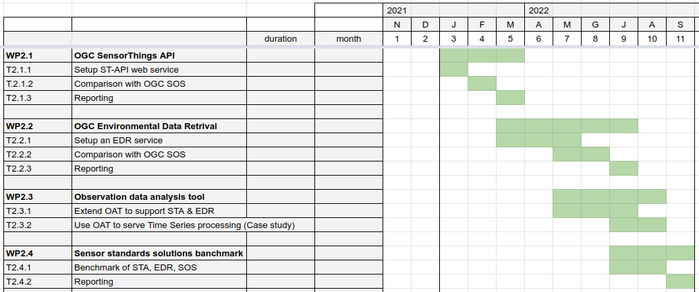

== Work Package 2 (WP2)
The Work Package 2 (named hereafter WP2) has the intent to evaluate the current OGC standards related to in-situ observations.

Namely, we'll investigate the:

* Sensor Observation Service https://www.ogc.org/standards/sos[(SOS)]
* SensorThingsAPI https://www.ogc.org/standards/sensorthings[(STA)]
* Environmental Data Retrival https://www.ogc.org/standards/ogcapi-edr[(EDR)]

=== Motivations
In-situ data collection and distribution provide key information to address several issues, particularly when combined with other data sources like satellite images or socio-economic contextual data.
In particular in-situ observations are key complementary data that support/complete satellite providing data that have high fidelity, resolution and consistency [1].

In 2022, OGC is launching another pilot, the Climate Change Services Initiative, which will run from 2022 through 2026.

[1] _Fekete, B. M., Robarts, R. D., Kumagai, M., Nachtnebel, H. P., Odada, E., & Zhulidov, A. V. (2015). Time for in situ renaissance._

=== Approach

The idea is to set-up experiment and compare the different standards trough different implementations to extrapolate practical considerations and advantages and disadvantages of the different OGC standards.

* setting up a Sensor Observation Service 
* setting up the Sensor Things API
* test registering new stations
* test inserting data
* test acquire metadata of sensor
* test acquire data

==== Questions

. How modern sensor architecture works?
. Does the standard fit with the up-to-date approaches?
. What are the advantages and drawbacks?

