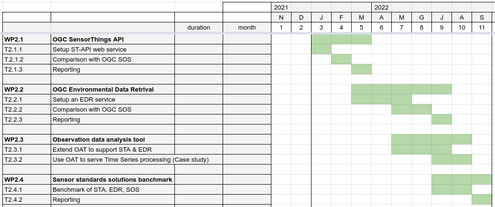
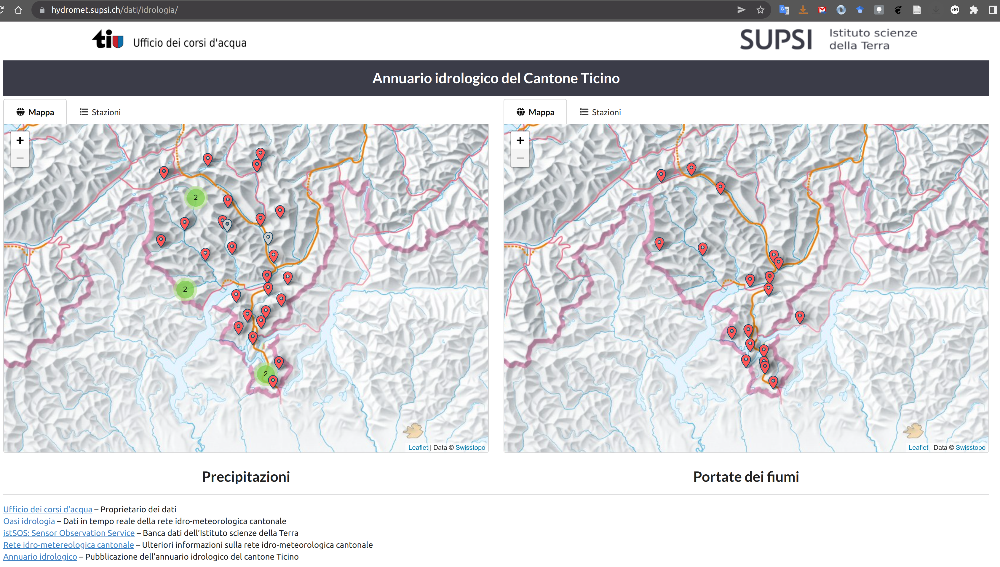

[.text-justify]
== Work Package 2 (WP2)
The Work Package 2 (named hereafter WP2) has the intent to evaluate the current OGC standards related to in-situ observations.

Namely, we'll investigate the:

* Sensor Observation Service https://www.ogc.org/standards/sos[(SOS)]
* SensorThingsAPI https://www.ogc.org/standards/sensorthings[(STA)]
* Environmental Data Retrival https://www.ogc.org/standards/ogcapi-edr[(EDR)]

=== Motivations
In-situ data collection and distribution provide key information to address several issues, particularly when combined with other data sources like satellite images or socio-economic contextual data.
In particular in-situ observations are key complementary data that support/complete satellite providing data that have high fidelity, resolution and consistency [1].

In 2022, OGC is launching another pilot, the Climate Change Services Initiative, which will run from 2022 through 2026.

[1] _Fekete, B. M., Robarts, R. D., Kumagai, M., Nachtnebel, H. P., Odada, E., & Zhulidov, A. V. (2015). Time for in situ renaissance._

=== Approach

The idea is to set-up experiment and compare the different standards trough different implementations to extrapolate practical considerations and advantages and disadvantages of the different OGC standards.

==== Software & standards
* setting up a Sensor Observation Service using istSOS
** installed at https://geoservice2.ist.supsi.ch/indg/istsos/admin/
* setting up the Sensor Things API using FROST
** installed at https://geoservice2.ist.supsi.ch/indg/frost/

==== Dataset

The hydro-meteorological monitoring network of the Canton Ticino (Southern Switzerland), which is currently managed using the SOS standard, has been selected as representative of a practical implementation of basic data required for the climate change impact assessment pipeline. The network, which has a 40 years long time-series, is currently composed of 60 stations and 140 sensors observing precipitation, air temperature and humidity, water temperature, river height. Collected information is operationally used by the local administration to design and actuate water resources protection and allocation to guarantee a sustainable management of the resource and the natural environment while protecting from the impacts of extreme events like floods and droughts. The Sensor Things API operational applicability is evaluated by testing the adopting this standard to fulfill all the major in place daily practical operations like for example data quality management, data sharing with third parties, data collection from vendor specific sensors and data analyses and visualization.

**
    A second dataset of possible interest consist in the observation of groundwater level and temperature in Canton Ticino. The observations are not sampled at regular time intervals and includes: 

    * Wells (7'999) with 210'780 observations
    * Boreholes (4'664) with 1'440'806 observations

    Mapping current DB with istSOS keys and prepare script to migrate data.
**

=== First test migrate automatic sensors

* migrate data to istSOS: DONE
* migrate data to FROST: DOING

Comparison:
how SOS fit the 

==== TODOS

* test registering new stations
* test inserting data
* test acquire metadata of sensor
* test acquire data

==== Questions

. How modern sensor architecture works?
. Does the standard fit with the up-to-date approaches?
. What are the advantages and drawbacks?

 - il sensore è il tipo di sensore (Optod-123) oppure lo specifico strumento con il suo serial number (Otpod-123 S/N: 12345) ? 
 - comse si tiene conto delle variazioni dei sensori su una stazione di misura long-term?
 - il datastream è legato a lla serie storica di monitoraggio di un punto di osservazione (a cui può nel tempo cambiare sensori etc..)?
 - il multidatastream è un'osservazione complessa (tipo array) ma non può essere recuperata per ciascuna componente: inserico (ws,wd) e le devo sempre prendere insieme?
 - la location è della Things

