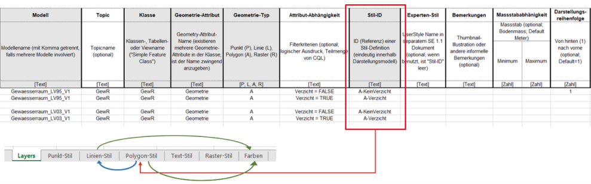
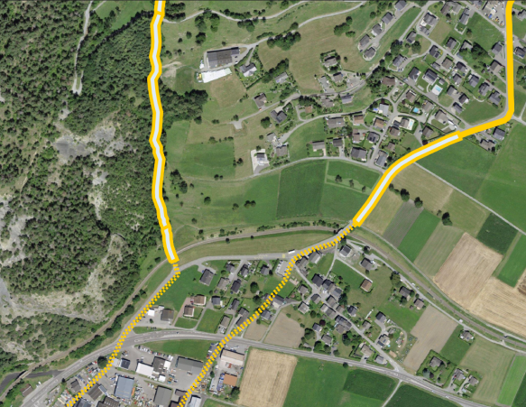

[.text-justify]
== Work Package 3 (WP3)

=== Background

In the context of data discovery, access and portrayal, the wellknown
OGC WxS standards WFS cite:[ogc-wfs], WMS cite:[ogc-wms], WMTS cite:[ogc-wmts] have been used for more than
ten years and still widely in use. In association with these
standards, styling aspects are defined by the standards SLD cite:[ogc-sld] & SE cite:[ogc-se]. These are typically referenced
by the eCH-0056 Geoservices Application Profile: WMS 1.3.0 (section 6.7), WMTS 1.0.0 (section 6.8), WFS 2.0 (section
6.9.2), WCS 2.0.1 (section 6.9.3), CSW 2.0.2 (section 6.10), SE
1.1.0 (section 6.11) and SLD 1.1.0 (section 6.12).

For this project part, we focus on standardisation work at the
OGC related to discovery, data access to visualisation, as made
available at https://ogcapi.ogc.org/ and according to their
versioning mentioned by Table 2. Indeed, the table describes
the relationship between the considered OGC APIs and their
current equivalents in the context of raster and vector related
standards.

.From WxS family to OGC APIs
[cols="1,1,1"]
|===
^.^|OGC API
^.^|Version
^.^|WxS fashioned
//
^.^|OGC API Features
^.^|1.0
^.^|WFS
//
^.^|OGC API Maps
^.^|0.0.1
^.^|WMS
//
^.^|OGC API Styles
^.^|1.0.0
^.^|SLD
//
^.^|OGC SymCore
^.^|1.0
^.^|SE
//
^.^|OGC API Tiles
^.^|0.0.4
^.^|WMTS
//
^.^|OGC API Records
^.^|1.0.0
^.^|CSW
|===

=== Testbed actions

To test and analyze these standards and specifications, two experimental
cases are setup:

* with the use of Geoclimate cite:[Bocher2021], an open
source geospatial toolbox that computes a set of urban climate
parameters based on OpenStreetMap data. The intent
is to publish these parameters with metadata, data and
maps using the new OGC APIs cite:[ogc-api]
* with the Swiss National geodata models that have been
published by the Swiss Government as Minimal Geodata
Models (MGM) cite:[mgm] using the Swiss INTERLIS modeling language. It
is also mandatory for these models to provide styling and
symbology instructions according to a spreadsheet-based
modelfootnote:[https://www.bafu.admin.ch/bafu/en/home/state/data/geodata-models/water--geodata-models.html]

.Styling and symbology instructions according to a spreadsheet-based model (from the Area reserved for water MGM)

.Geocss styling instructions for Area reserved for water MGM
=================
[source,css]
----
/* Metadata
* @title GeoCSS encoding for Geoserver
* @abstract Representation model
*/
/* Main rule*/
*{
  /* @title ERE */
  [obligation = 1 ] {
    fill:#ddebf7;
      stroke:#ffcc00;
      stroke-width: 6px;
    };
  /* @title Renonciation */
  [obligation = 0 ] {
      stroke:#ffcc00;
      stroke-width: 4px;
    	stroke-dasharray: 4 4;
    };
}
----
=================

.Overview of the Area reserved for water portrayal using the above GeoCSS encoding for GeoServer

=== First elements to highlight

Regarding the publication of vector data using the OGC API
Features standard, we can state that all software packages
already support this standard cite:[ogc-api-feature-implementations]. Regarding the
tiling of data sets, for a long time the existing WMTS standard
has been largely used, but a standard for vector tiling has
never been established up to now. A possible explanation for
this lack of standardization is on the one hand the complexity
of vector tiling (e.g. regarding the handling of attributes or
projections), but on the other hand the success of the Mapbox
Vector tiles specification cite:[mvt-spec] that have been widely
adopted. The OGC API Tiles specification is on a conceptual
level similar to the WMTS standard and defines the addressing
and tiling of the data. One difference is that the OGC API
Tiles specification allows for several formats (both vector and
raster) to be computed. This way of defining tiles assures on the
one hand the compatibility with existing WMTS services (i.e.
allowing applications to easily integrate both existing WMTS
layers with tiled vector layers), but also with the Mapbox Vector
tiles specification. On the software side Geoserver already
supports the OGC-API tiles specification rendering the formats
jpg, png, GeoJSON, topojson and mapbox-vector-tile.

Concerning portrayal, we may notice two related aspects: about
OGC API Styles, about OGC SymCore. Firstly, OGC API
Styles is inline with the conceptual model for styles, style encodings
and style metadata as documented in chapter 6 of the
OGC Testbed-15: Encoding and Metadata Conceptual Model
for Styles Engineering Report. Especially it states that a style
may be made available in one or more so-called stylesheets.
Moreover style metadata are made available through the API
with general descriptive information about the style, structural
information (e.g., layers and attributes), and so forth to allow
users to discover and select existing styles for their data. Having
several stylesheets available does not guarantee the same
visualization of the cartographic result for the final user, because
each stylesheet may be based on different models and encodings (e.g. SLD, Mapbox style, GeoCSS, etc). Nonetheless,
it opens the possibility to make full use of the cartographic
capabilities and richness of the various underlying symbology
models.

Secondly, OGC SymCore pushes forward portrayal interoperability
with the idea to standardize also the symbology part.
The approach is so-called one conceptual model, many encodings,
which means that many flavors of encodings are possible
but each in conformance with a common conceptual rendering
behavior of cartographic capabilities. The intent is that finally,
independently of the compliant encoding used, the cartographic
result will be the same for the final user.